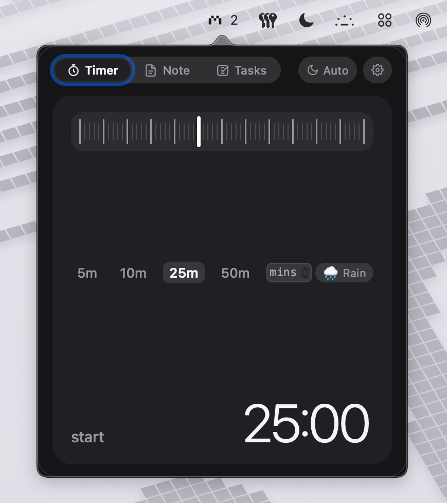
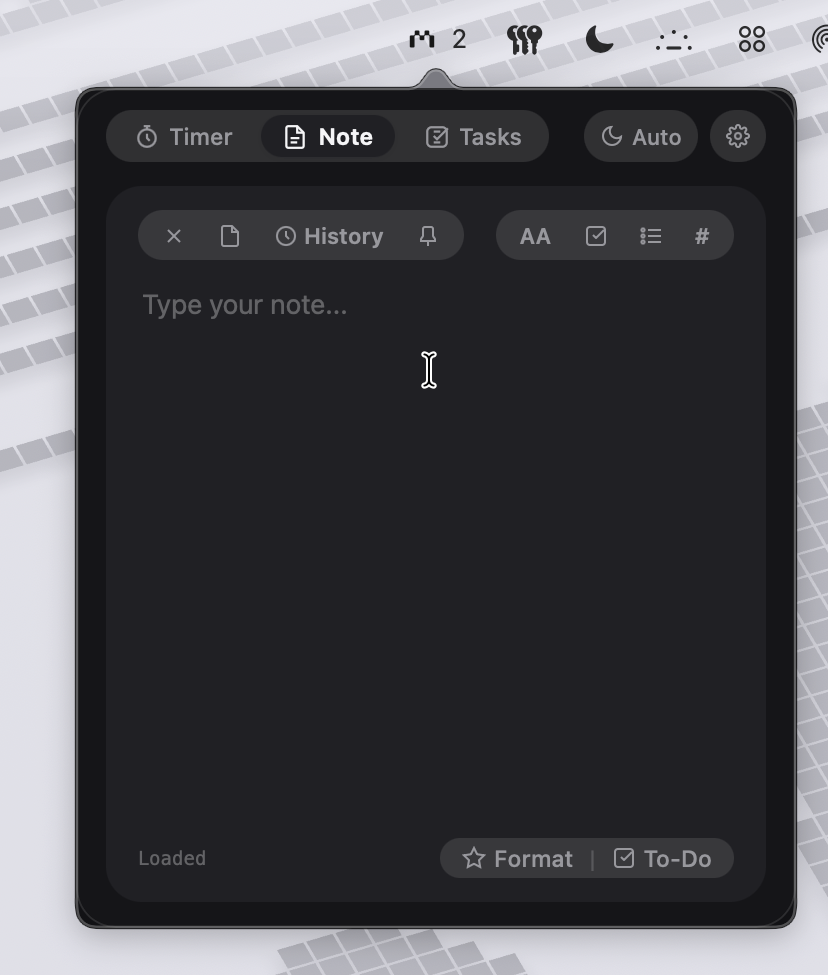
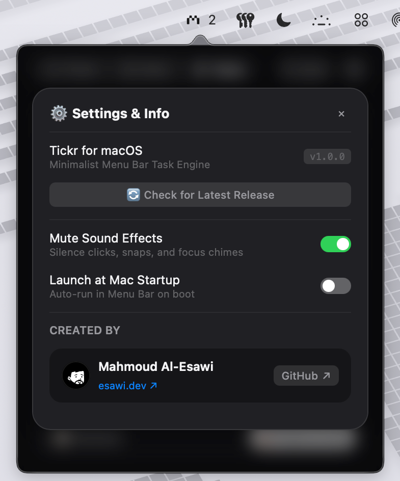
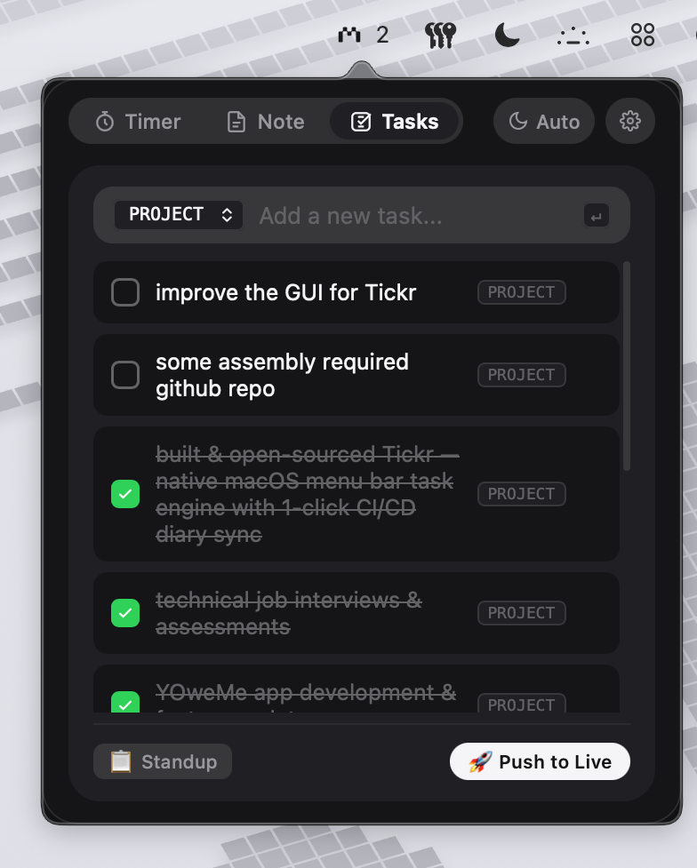

# ⚡ Tickr for macOS

<p align="center">
  
</p>

<p align="center">
  <b>A minimalist, native macOS Menu Bar productivity engine combining a mechanical Pomodoro timer, distraction-free markdown scratchpad, and task manager with 1-click CI/CD portfolio deployment.</b>
</p>

<p align="center">
  <a href="https://github.com/MahmoudEsawi/Tickr/releases/latest"></a>
  <a href="https://github.com/MahmoudEsawi/Tickr/blob/main/LICENSE"></a>
  <a href="https://esawi.dev"></a>
</p>

---

## 📸 Interface Preview

<div align="center">
  <table>
    <tr>
      <td width="50%" align="center">
        <b>⏱️ 1. Onigiri Pomodoro & Scrubber</b><br><br>
        
      </td>
      <td width="50%" align="center">
        <b>📝 2. SlashNote & Multi-Note History</b><br><br>
        
      </td>
    </tr>
    <tr>
      <td width="50%" align="center">
        <b>☑️ 3. Task Manager & Standup Copy</b><br><br>
        
      </td>
      <td width="50%" align="center">
        <b>⚙️ 4. Settings & Sound Controls</b><br><br>
        
      </td>
    </tr>
  </table>
</div>

---

## ✨ Features

* **⏱️ Mechanical Pomodoro Timer**: Draggable / clickable ruler scrubber with 60-tick precision, duration presets (`5m`, `10m`, `25m`, `50m`), custom minute entry, and live menu bar countdown.
* **🌧️ Ambient Focus Audio**: Procedurally synthesized background rain generator for deep work sessions.
* **🔊 Synthesized Haptics**: Mechanical Apple Watch Digital Crown tick sounds and tactile completion snaps built with the Web Audio API.
* **📝 SlashNote Sticky Notepad**: Minimalist markdown scratchpad with full **Multi-Note History**, instant search, format actions, and auto-save.
* **📌 Floating HUD Mode (Always on Top)**: Pin Tickr above all active windows while coding in VS Code or designing in Figma.
* **📋 1-Click Standup Report**: Formats today's accomplishments into clean markdown and copies it straight to your clipboard.
* **🚀 Git Portfolio Sync**: 1-click push that commits completed tasks directly to your personal website diary via GitHub CI/CD.
* **💻 Terminal & Raycast CLI**: Companion CLI (`./cli.py add "Task"`) for Terminal and launcher workflows.
* **🌓 System Appearance Sync**: Follows macOS Light & Dark modes automatically in real time.

---

## 🚀 Installation

### Option 1: Direct Download (DMG)
1. Download **`Tickr-v1.0.0.dmg`** from [**Latest Releases**](https://github.com/MahmoudEsawi/Tickr/releases/latest).
2. Open the `.dmg` and drag **Tickr.app** into your `/Applications` folder.
3. Launch Tickr from Spotlight (<kbd>⌘</kbd> + <kbd>Space</kbd> $\rightarrow$ `Tickr`).

### Option 2: Homebrew Cask
```bash
brew tap mahmoudesawi/tap
brew install --cask tickr
```

---

## ⌨️ Keyboard Shortcuts

| Shortcut | Action |
| :--- | :--- |
| <kbd>⌘</kbd> + <kbd>⇧</kbd> + <kbd>T</kbd> | Summon / Toggle Tickr HUD from anywhere |
| <kbd>⌥</kbd> + <kbd>Space</kbd> | Alternative instant HUD summon |
| <kbd>↵ Enter</kbd> | Add task / set custom minutes |
| <kbd>Esc</kbd> | Dismiss HUD popover |

---

## 📖 In-Depth Documentation

For architecture specifications, WebKit IPC bridges, build scripts, and developer guides:

👉 **[Read the Full Technical Documentation (DOCUMENTATION.md)](DOCUMENTATION.md)**

---

## 👨‍💻 Author

Crafted with care by **Mahmoud Al-Esawi**  
* Website: [esawi.dev](https://esawi.dev)
* GitHub: [@MahmoudEsawi](https://github.com/MahmoudEsawi)
* Open Source Repository: [github.com/MahmoudEsawi/Tickr](https://github.com/MahmoudEsawi/Tickr)

---

## 📄 License

Distributed under the **MIT License**.
