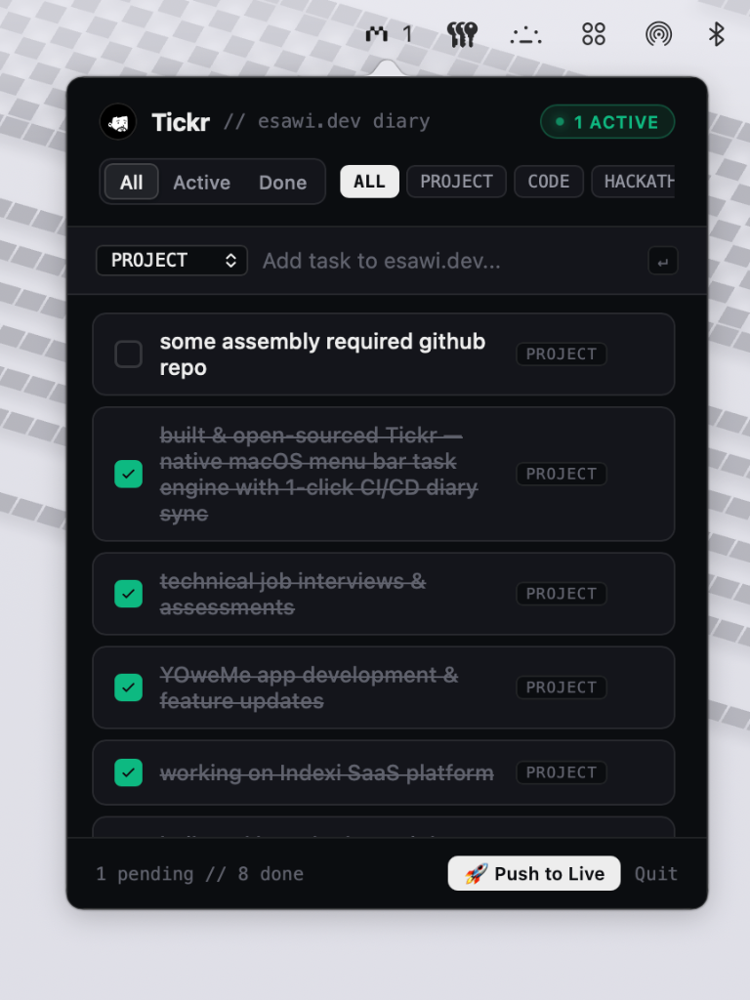

<div align="center">

# Tickr for macOS

**Minimalist menu bar task engine with bidirectional JSON synchronization and 1-click CI/CD deployment.**

<br />



<br /><br />

[](https://apple.com/macos)
[](LICENSE)
[](https://esawi.dev)
[](CONTRIBUTING.md)

</div>

---

## Overview

Tickr is a lightweight macOS status bar application engineered for distraction-free task management and rapid engineering logging. It lives directly in the native macOS menu bar and provides an instant HUD popover with zero background battery impact.

Originally built to bridge local daily tasks with the live Developer Diary on [esawi.dev](https://esawi.dev/diary), Tickr supports bidirectional JSON syncing and automated 1-click Git and CI/CD publishing.

---

## Features

* **Menu Bar Resident**: Sits quietly in the top status bar as an accessory item with live active task counters.
* **Instant Capture**: Add tasks instantly via the HUD input field using `↵ Return`.
* **Category Tagging**: Organize items with customizable tags (`PROJECT`, `CODE`, `HACKATHON`, `DAILY`, `IDEAS`).
* **Bidirectional Sync**: Automatically syncs state with your JSON schema or local application support storage.
* **1-Click Live Deployment**: Integrated Git workflow commits and pushes completed milestone logs to trigger automated production deployments (e.g. Vercel, Netlify, GitHub Actions).
* **Keyboard-First Workflow**: Full keyboard navigation, filter tabs (`All`, `Active`, `Done`), and quick search.

---

## Architecture

```text
Tickr/
├── assets/
│   ├── menu_icon.png          # Retina menu bar status item asset
│   ├── avatar.svg             # Vector brand avatar
│   └── screenshot.png         # Interface preview
├── ui/
│   ├── index.html             # High-contrast dark engineering HUD
│   └── assets/                # Web interface icons and assets
├── tickr_app.py               # Native PyObjC Cocoa & WebKit daemon
├── Package.swift              # Swift Package Manager manifest
└── README.md
```

---

## Quick Start

### Prerequisites
* macOS 13 (Ventura) or later
* Python 3.10+
* `pip3 install pyobjc-framework-Cocoa pyobjc-framework-WebKit`

### Running Locally
```bash
# 1. Clone the repository
git clone https://github.com/MahmoudEsawi/Tickr.git
cd Tickr

# 2. Start the menu bar application
python3 tickr_app.py
```

---

## Configuration

By default, Tickr saves task data to:
* `~/Library/Application Support/Tickr/tasks.json`

To link Tickr with your own custom portfolio, blog, or diary repository, update the `DIARY_DIR` path in `tickr_app.py`:

```python
DIARY_DIR = os.path.expanduser("~/path/to/your/project")
DIARY_PATH = os.path.join(DIARY_DIR, "src/data/diary.json")
```

---

## Contributing

Contributions, bug reports, and feature requests are welcome. Please read [CONTRIBUTING.md](CONTRIBUTING.md) before submitting pull requests.

---

## License

Distributed under the **MIT License**. See [LICENSE](LICENSE) for details.
