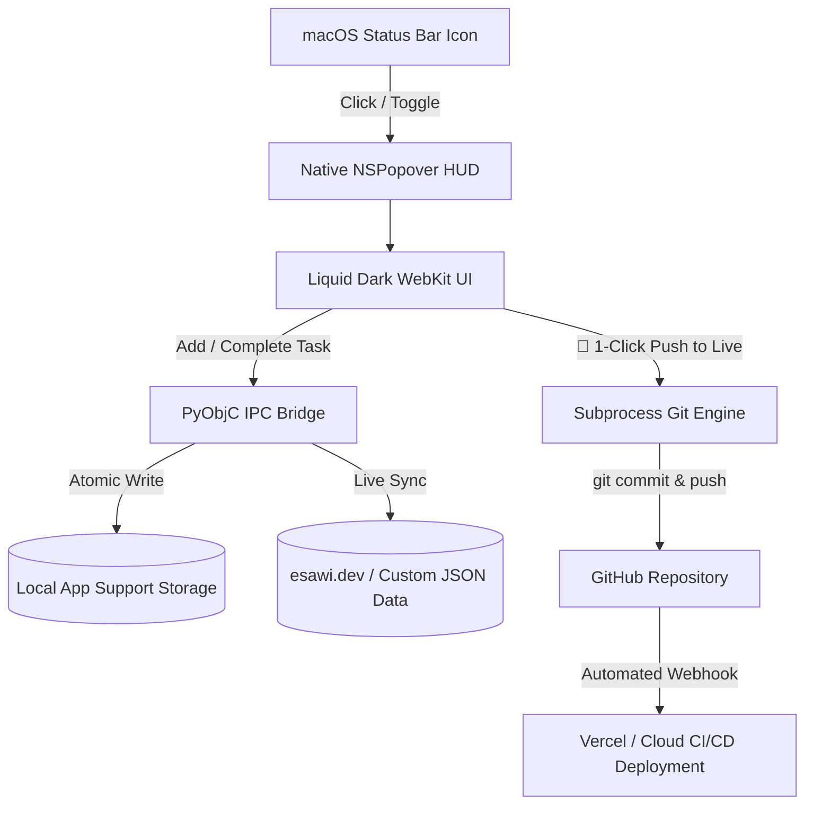

<div align="center">

# Tickr for macOS

**Minimalist menu bar task engine with bidirectional JSON synchronization and 1-click CI/CD deployment.**

<br />


<br /><br />

[](https://apple.com/macos)
[](https://github.com/MahmoudEsawi/Tickr/releases/tag/v1.0.0)
[](LICENSE)
[](https://esawi.dev)
[](CONTRIBUTING.md)

</div>

---

## 📑 Table of Contents
- [Overview](#overview)
- [Architecture & System Design](#architecture--system-design)
- [Key Features](#key-features)
- [Installation](#installation)
- [Keyboard Shortcuts](#keyboard-shortcuts)
- [Configuration & Integrations](#configuration--integrations)
- [Troubleshooting & Help (FAQ)](#troubleshooting--help-faq)
- [Roadmap](#roadmap)
- [Contributing](#contributing)
- [License](#license)

---

## Overview

**Tickr** is an ultra-lightweight macOS status bar daemon engineered for distraction-free task management, rapid engineering logging, and automated production publishing. 

Originally built to bridge local engineering sprints with the live Developer Diary on [esawi.dev](https://esawi.dev/diary), Tickr provides a native macOS Menu Bar HUD, customizable category tagging, local persistence, and automated 1-click Git + CI/CD deployments to cloud hosts (Vercel, Netlify, Cloudflare).

---

## Architecture & System Design



### Technical Stack
* **Native Runtime**: macOS AppKit (`NSStatusBar`, `NSStatusItem`, `NSPopover`, `NSApplicationActivationPolicyAccessory`).
* **Frontend Engine**: Apple WebKit (`WKWebView`) rendering an optimized dark engineering interface (`-apple-system`, SF Mono).
* **IPC Communication**: Native two-way message routing via `WKScriptMessageHandler` (zero open network ports, 100% private).
* **Storage Engine**: Atomic JSON serialization with automatic directory bootstrapping and fallback schemas.

---

## Key Features

* ⚡ **Menu Bar Resident (`LSUIElement`)**: Stays docked in the top macOS Menu Bar with live pending counters. Zero window clutter and negligible memory consumption (< 25 MB RAM).
* 🏷️ **Dynamic Tag Manager GUI**: Full built-in modal to create, edit, and delete custom tags (`PROJECT`, `CODE`, `DAILY`, `IDEAS`, etc.) with instant filter syncing.
* 🚀 **1-Click Live Deployment**: Integrated Git workflow automatically stages, commits, and pushes task updates to trigger web deployments in real-time.
* 🔄 **Bidirectional JSON Sync**: Seamlessly reads and updates external schemas (e.g. Developer Diaries, personal portfolios, static site generators).
* ⌨️ **Keyboard-First Workflow**: Designed for engineers who prioritize speed — add tasks and switch filters without leaving the keyboard.
* 🔊 **Audio & Visual Feedback**: Real-time synthesized web audio click/chime effects and smooth micro-animations.

---

## Installation

### Option 1: Direct Download (DMG Installer)

1. Download the latest release:
   * **[Download Tickr-v1.0.0.dmg](https://github.com/MahmoudEsawi/Tickr/releases/latest/download/Tickr-v1.0.0.dmg)** *(macOS Disk Image)*
   * **[Download Tickr-v1.0.0-macOS.zip](https://github.com/MahmoudEsawi/Tickr/releases/latest/download/Tickr-v1.0.0-macOS.zip)** *(ZIP Archive)*
2. Open `Tickr-v1.0.0.dmg` and drag **Tickr.app** into your `/Applications` folder.
3. Launch **Tickr** from Spotlight or Applications.

> [!NOTE]
> **First-Time Launch on macOS (Gatekeeper)**:  
> Because Tickr is open-source and distributed directly via GitHub, right-click `Tickr.app` $\rightarrow$ click **Open** $\rightarrow$ click **Open** on the confirmation prompt.  
> Alternatively, run in Terminal: `xattr -cr /Applications/Tickr.app`

---

### Option 2: Clone & Run via Terminal

```bash
# 1. Clone the repository
git clone https://github.com/MahmoudEsawi/Tickr.git
cd Tickr

# 2. Install PyObjC dependencies (if needed)
pip3 install pyobjc-framework-Cocoa pyobjc-framework-WebKit

# 3. Start the application
python3 tickr_app.py
```

---

## Keyboard Shortcuts

| Shortcut | Context | Action |
| :--- | :--- | :--- |
| <kbd>↵ Return</kbd> | Task Input Field | Add new task immediately |
| <kbd>↵ Return</kbd> | Tag Manager Input | Add new custom category tag |
| <kbd>Esc</kbd> | Anywhere | Dismiss popover / Close Tag Modal |
| <kbd>Tab</kbd> | Inputs | Shift focus between input and tag selector |

---

## Configuration & Integrations

### 1. Default Local Storage
If used standalone, Tickr stores data locally in:
```text
~/Library/Application Support/Tickr/
├── tasks.json    # Task state & completion history
└── tags.json     # User custom category tags
```

### 2. Linking to Your Portfolio or Blog (e.g. Next.js / Astro / Hugo)
To link Tickr with your own website's JSON data source, open `tickr_app.py` and configure the target repository path:

```python
# Path to your web project root
DIARY_DIR = os.path.expanduser("~/Projects/my-portfolio")

# Path to your JSON data file
DIARY_PATH = os.path.join(DIARY_DIR, "src/data/diary.json")
```

When you click **`🚀 Push to Live`**, Tickr executes a Git commit & push in `DIARY_DIR`, triggering your production deployment.

---

## Troubleshooting & Help (FAQ)

<details>
<summary><b>1. Why doesn't a center window appear when I open Tickr?</b></summary>

Tickr is a **Menu Bar App** (`LSUIElement = true`). It does not create a standard desktop window or Dock icon. Look at the **top right corner of your screen (in your macOS Menu Bar next to WiFi and Clock)** to find the Tickr icon. Click it to open the HUD!
</details>

<details>
<summary><b>2. How do I bypass the macOS "App could not be verified" warning?</b></summary>

Open **Terminal** and run:
```bash
xattr -cr /Applications/Tickr.app
```
Or go to **System Settings → Privacy & Security** and click **Open Anyway**.
</details>

<details>
<summary><b>3. How do I set Tickr to Launch at Login automatically?</b></summary>

1. Open macOS **System Settings** $\rightarrow$ **General** $\rightarrow$ **Login Items**.
2. Under **Open at Login**, click the **`+`** button and select `Tickr.app` from `/Applications`.
</details>

<details>
<summary><b>4. ModuleNotFoundError: No module named 'WebKit'</b></summary>

Ensure you have installed the WebKit PyObjC bridge:
```bash
pip3 install pyobjc-framework-Cocoa pyobjc-framework-WebKit
```
</details>

---

## Roadmap

- [x] Native macOS Status Bar integration with `NSPopover`
- [x] Dynamic Custom Tag Manager GUI
- [x] Bidirectional JSON sync with Developer Diary
- [x] 1-Click CI/CD deployment trigger
- [x] macOS `.icns` asset packaging & DMG release
- [ ] Global toggle hotkey (<kbd>⌥ Option</kbd> + <kbd>Space</kbd>)
- [ ] Homebrew Cask formula (`brew install --cask tickr`)
- [ ] Pomodoro focus timer integrated into the status item
- [ ] Raycast / Alfred extension integration

---

## Contributing

Contributions, bug reports, and suggestions are welcome!
1. Fork the Project (`git checkout -b feature/AmazingFeature`)
2. Commit your Changes (`git commit -m 'feat: add amazing feature'`)
3. Push to the Branch (`git push origin feature/AmazingFeature`)
4. Open a Pull Request

Please adhere to the [Code of Conduct](CODE_OF_CONDUCT.md) and [Contributing Guidelines](CONTRIBUTING.md).

---

## License

Distributed under the **MIT License**. See [LICENSE](LICENSE) for more information.
