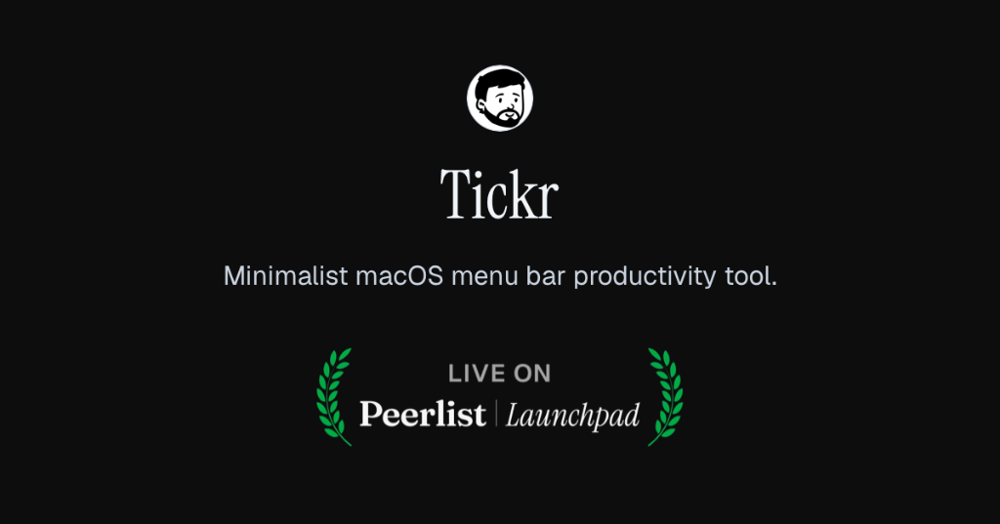
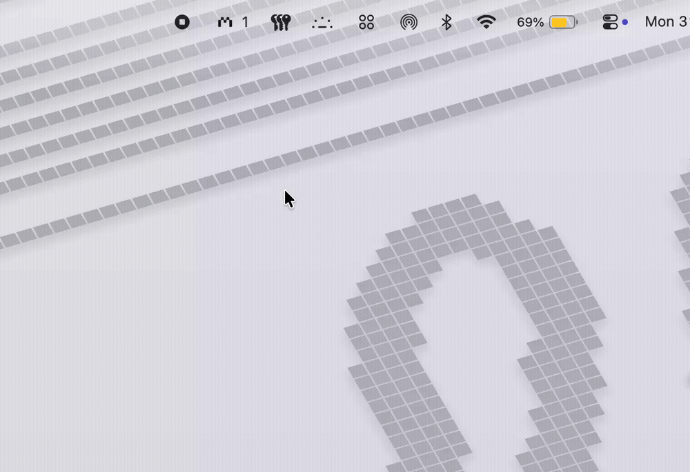

# Tickr

A minimalist macOS menu bar productivity tool combining a precision focus timer, markdown scratchpad, and task engine.

[Release](https://github.com/MahmoudEsawi/Tickr/releases/latest) · [Peerlist Launchpad](https://peerlist.io) · [Documentation](DOCUMENTATION.md) · [Website](https://esawi.dev)

---

<div align="center">
  
</div>

---

## Demo

<div align="center">
  
</div>

---

## Interface

<div align="center">
  <table>
    <tr>
      <td width="50%" align="center">
        <b>Timer</b><br><br>
        
      </td>
      <td width="50%" align="center">
        <b>Note</b><br><br>
        
      </td>
    </tr>
    <tr>
      <td width="50%" align="center">
        <b>Tasks</b><br><br>
        
      </td>
      <td width="50%" align="center">
        <b>Settings</b><br><br>
        
      </td>
    </tr>
  </table>
</div>

---

## Highlights

- Precision mechanical ruler scrubber with sound synthesis
- Ambient focus rain generator
- Multi-note markdown scratchpad with instant search
- 1-Click export to Apple Notes with formatted typography
- Floating HUD pin mode
- 1-Click daily standup exporter
- Automated git diary deployment
- Terminal and Raycast CLI companion
- Native system appearance synchronization

---

## Installation

### Homebrew
```bash
brew tap mahmoudesawi/tap
brew install --cask tickr
```

### Direct Download
Download `Tickr-v1.0.0.dmg` from the [latest release](https://github.com/MahmoudEsawi/Tickr/releases/latest).

---

## Shortcuts

| Shortcut | Action |
| :--- | :--- |
| `⌘` + `⇧` + `T` / `⌥` + `Space` | Toggle Tickr HUD |
| `⌘` + `A` | Select All (inputs, scratchpad) |
| `⌘` + `C` / `⌘` + `V` / `⌘` + `X` | Copy / Paste / Cut |
| `⌘` + `Z` / `⌘` + `⇧` + `Z` | Undo / Redo |
| `⌘` + `B` / `⌘` + `I` / `⌘` + `K` | Bold / Italic / Code inline in Note |
| `⌘` + `E` | Export active note to Apple Notes |
| `⌘` + `N` | New note / new task |
| `⌘` + `1` / `2` / `3` / `4` | Switch Tab (Timer, Note, Tasks, Settings) |
| `Tab` | Indent text in Note Editor (2 spaces) |
| `Enter` | Submit task / set timer duration |
| `Esc` | Close drawer / dismiss HUD |

---

## Documentation

Full technical architecture, WebKit IPC bridges, and CLI workflows are available in [DOCUMENTATION.md](DOCUMENTATION.md).

---

## Author

Mahmoud Al-Esawi · [esawi.dev](https://esawi.dev) · [GitHub](https://github.com/MahmoudEsawi)
